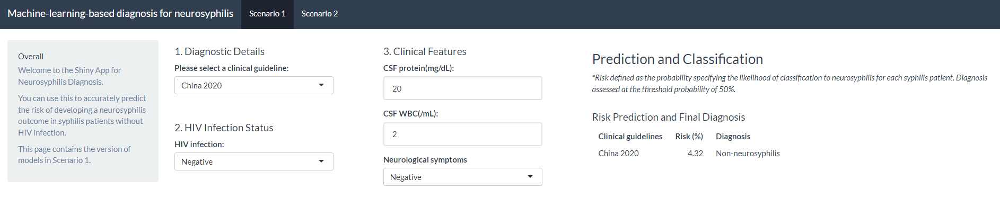

# Machine-learning-based-diagnosis-for-neurosyphilis

This is a Shiny app for this article (citation below), to enable users to apply the simplified clinical diagnostic models for neurosyphilis. It's build in R with `shiny`. Check it out at https://zhen-lu.shinyapps.io/Machine-learning-based-diagnosis-for-neurosyphilis/.

Zou, H., Lu, Z., Weng, W., Yang, L., Yang, L., Leng, X., Wang, J., Lin, Y.-F., Wu, J., Fu, L., Zhang, X., Li, Y., Wang, L., Wu, X., Zhou, X., Tian, T., Huang, L., Marra, C. M., Yang, B., . . . Ke, W. (2023). Diagnosis of neurosyphilis in HIV-negative patients with syphilis: development, validation, and clinical utility of a suite of machine learning models. eClinicalMedicine, 62. https://doi.org/10.1016/j.eclinm.2023.102080 

## Contact
In case of issues with the Shiny app, please let us know through the Issues functionality and/or contact Zhen Lu (luzh29@mail2.sysu.edu.cn).
