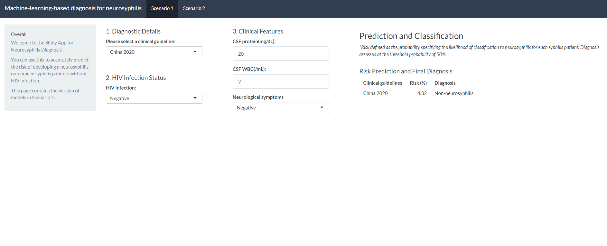

# Machine-learning-based-diagnosis-for-neurosyphilis

This is a Shiny app for this article (citation below), to enable users to apply the simplified clinical diagnostic models for neurosyphilis. It's build in R with `shiny`. Check it out at https://zhen-lu.shinyapps.io/Machine-learning-based-diagnosis-for-neurosyphilis/.

"Development, validation and clinical utility of simplified clinical diagnostic models for neurosyphilis"

## Contact
In case of issues with the Shiny app, please let us know through the Issues functionality and/or contact Zhen Lu (luzh29@mail2.sysu.edu.cn).
